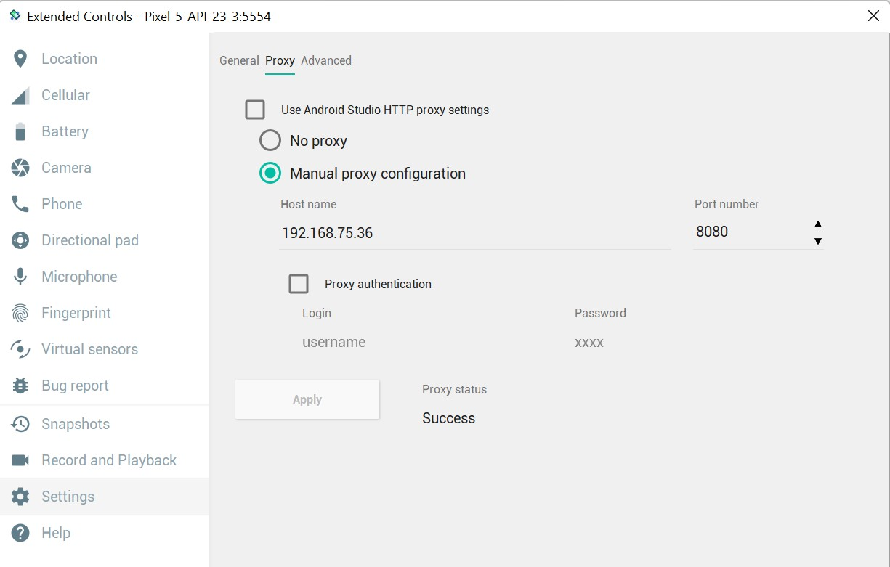
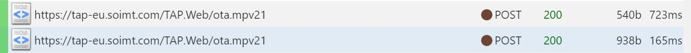
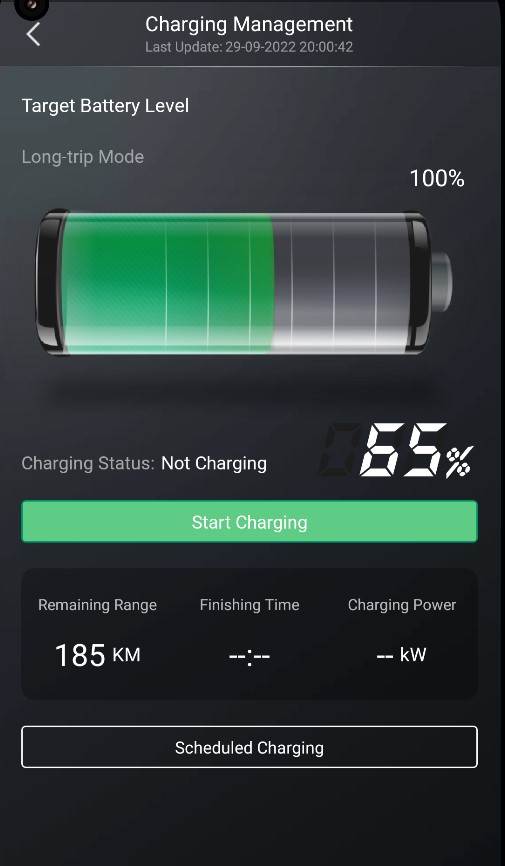
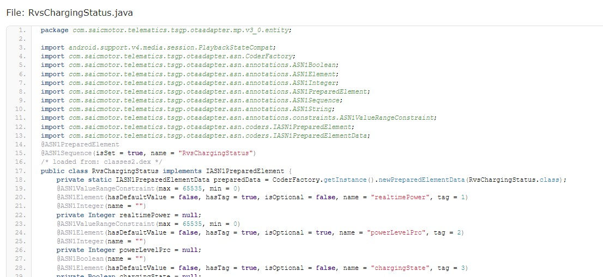

<!-- Improved compatibility of back to top link: See: https://github.com/othneildrew/Best-README-Template/pull/73 -->
<a name="readme-top"></a>
<!--
*** Thanks for checking out the Best-README-Template. If you have a suggestion
*** that would make this better, please fork the repo and create a pull request
*** or simply open an issue with the tag "enhancement".
*** Don't forget to give the project a star!
*** Thanks again! Now go create something AMAZING! :D
-->


<!-- PROJECT SHIELDS -->
<!--
*** I'm using markdown "reference style" links for readability.
*** Reference links are enclosed in brackets [ ] instead of parentheses ( ).
*** See the bottom of this document for the declaration of the reference variables
*** for contributors-url, forks-url, etc. This is an optional, concise syntax you may use.
*** https://www.markdownguide.org/basic-syntax/#reference-style-links
-->
[![Contributors][contributors-shield]][contributors-url]
[![Forks][forks-shield]][forks-url]
[![Stargazers][stars-shield]][stars-url]
[![Issues][issues-shield]][issues-url]
[![MIT License][license-shield]][license-url]


<!-- PROJECT LOGO -->
<br />
<div align="center">
 

<h3 align="center">SAIC-API Documentation (MG iSmart/iSmart lite) </h3>

  <p align="center">
    We try to understand how the SAIC-API used by MG cars (MG5 EV, MG ZSV...) works and how we can interact with it.
    <br />
    <a href="https://github.com/ReverseEngineeringDE/SAIC-API-Documentation"><strong>Explore the docs »</strong></a>
    <br />
    <br />
    <a href="https://github.com/ReverseEngineeringDE/SAIC-API-Documentation">Current state</a>
    ·
    <a href="https://github.com/ReverseEngineeringDE/SAIC-API-Documentation/issues">Report Bug</a>
    ·
    <a href="https://github.com/ReverseEngineeringDE/SAIC-API-Documentation/issues">Request Feature</a>
  </p>
</div>


<!-- ABOUT THE PROJECT -->
## About The Project
The project consists of the readme, some sample Python code and the ASN.1 schemas. With this project we try to get rid of the slow and complicated iSmart-Application on iOS and Android.

If we completely understand the API we can start to build adapters for projects like [Sonne tanken](https://github.com/evcc-io/evcc) and a integration for [Home Assistant](https://github.com/home-assistant).

What's working:
- [x] First version of [asn1extractor](#asn1extractor)

What's in progress:
- [ ] Understanding the ASN.1 post response for vehicleStatus.
- [ ] Extracting ASN.1 schema for ota.mpv30

To-Do:
- [ ] Get SOC state of vehicle
- [ ] Get GPS position
- [ ] Login via post requests


<p align="right">(<a href="#readme-top">back to top</a>)</p>


<!-- GETTING STARTED -->
## Getting Started

If you want to start debugging and exploring the API (and you do not have an access token) you need:
- [android studio](https://developer.android.com/studio)
- [mitmproxy](https://mitmproxy.org/)
- a MG car that is compatible with iSmart

It consists of two steps:

- [Step 1](#android-studio-and-mitmproxy):  Collect API sample response from the iSmart application with android studio and mitmproxy
- [Step 2](#python-sample-code): Try to decode the post response with the sample python code

### android studio and mitmproxy

Use android studio to emulate the iSmart application and collect the api calls with [mitmproxy](https://mitmproxy.org/). Inspired by [this medium article](https://medium.com/hackernoon/intercept-https-traffic-on-a-android-emulator-46023f17f6b3)

1. Download and install and install [android studio](https://developer.android.com/studio)
2. Create a Android virtual device (AVD) in android studio (working combination)
   ```
   Pixel 5 API 23
   Android 6.0 armeabi-v7a (custom certificates only work until android 6.0!)
   increase interal storage to 2GB
   ``` 
3. Uncheck "Launch in tool window" in android studio (File->Settings->Tools->Emulator)
4. Launch AVD (will take 5-10 minutes, slow emulation)
5. [Download iSmart APK](https://apkcombo.com/downloader/#package=com.saicmotor.iov.europe)
6. Install iSmart APK via ADB (will take 10-20 minutes)
```
.\adb.exe install "path\to\iSmart.apk"
```
7. Open AVD configuration window and set proxy settings (according to your own desktop IP)

8. Install mitmproxy certificate by browsing to mitm.it on the emulated android device.

9. Download and install and install [mitmproxy](https://mitmproxy.org/)
10. Launch mitmproxy and start collecting API requests of the emulated android device and iSmart application
![SAIC-API requests][product-screenshot]


### python sample code
The python sample code tries to decode the ASN.1 iSmart post responses collected by mitmproxy.

1. Install [asn1tools](https://pypi.org/project/asn1tools/) with pip
   ```python
   pip install asn1tools
   ```
2. Refresh the main screen of the iSmart app and copy the API response from mitmproxy into the file ```/src/response.per```
3. Run ```/src/decodeSampleResponse.py```
4. Experiment with the ASN.1 schema and try to understand and decode it

<p align="right">(<a href="#readme-top">back to top</a>)</p>


## API Documentation
This will be extended in the following days. WIP!

Two endpoints are used:
- [Vehicle endpoint](#vehicle-saic-ota-endpoint): Vehicle data
- [App endpoint](#saic-gateway): Other application data

### Vehicle SAIC OTA Endpoint
The android app requests sends the following two requests if the main screen is refreshed:



This endpoint is used to communicate with the vehicle API. The response data needs to be converted to Hex and can be used in the python code sample. See [Step 2](#python-sample-code)

The response seems to be containing **vehicleData, SOC, GPS position, locking state, driving state....** encoded in ASN.1 with PER. [ASN.1 schema](/ASN.1%20schema/ApplicationDataMP.asn1) 

#### Request 1:
The RAW-Body consists of ASN.1 data (WIP not sure what it contains, access tokens? passwords?)
```
POST https://tap-eu.soimt.com/TAP.Web/ota.mpv21 HTTP/1.1
Content-Length: 269
Content-Type: text/html
Host: tap-eu.soimt.com
Connection: Keep-Alive
User-Agent: Apache-HttpClient/UNAVAILABLE (java 1.4)
RAW-Body: 10087217300...(truncated user data/privacy)......00465014002 
```
<details>
  <summary>Curl command</summary>
  curl -H 'Content-Type: text/html' -H 'Host: tap-eu.soimt.com' -H 'Connection: Keep-Alive' -H 'User-Agent: Apache-HttpClient/UNAVAILABLE (java 1.4)' -X POST https://tap-eu.soimt.com/TAP.Web/ota.mpv21 -d 1008720...(truncated user data/privacy)......465014002
</details>

#### Response 1:
```
HTTP/1.1 200 
Date: Wed, 28 Sep 2022 10:21:18 GMT
Content-Type: text/html;charset=iso-8859-1
Transfer-Encoding: chunked
Connection: keep-alive
Set-Cookie: JSESSIONID=9FD...(truncated user data/privacy)..7083F; Path=/TAP.Web; HttpOnly
out_timestamp: 1664360478431
RAW-Body (270 symbols): 100882175...(truncated user data/privacy)..00006501400000
```

#### Request 2:
Same as Request 1 but with slighty changed RAW-Body.

#### Response 2:
```
HTTP/1.1 200 
Date: Wed, 28 Sep 2022 10:21:19 GMT
Content-Type: text/html;charset=iso-8859-1
Transfer-Encoding: chunked
Connection: keep-alive
Set-Cookie: JSESSIONID=455F97...(truncated user data/privacy).72AE; Path=/TAP.Web; HttpOnly
out_timestamp: 1664360479271
RAW-Body (670 symbols): 1014F21750031...(truncated user data/privacy)..004000
```


### SAIC gateway
This endpoint is used to register a account (access tokens?), to accept account GDPR and get app specific data (timezone, country list).

Example timezone request:
```
GET https://gateway-eu.soimt.com/api.app/v1/user/timezone HTTP/1.1
APP-LANGUAGE-TYPE: en
APP-USER-ID: 00000000000000000000000000.(truncated user data/privacy)002
APP-SEND-DATE: 1664360420536
Content-Type: application/json;charset=UTF-8
APP-CONTENT-ENCRYPTED: 0
APP-LOGIN-TOKEN: 06f4...(truncated user data/privacy)..210e0
Host: gateway-eu.soimt.com
Connection: Keep-Alive
No content
```

Example timezone response:
```
HTTP/1.1 200 
Date: Wed, 28 Sep 2022 10:20:21 GMT
Content-Type: application/json;charset=UTF-8
Transfer-Encoding: chunked
Connection: keep-alive
X-Content-Type-Options: nosniff
X-XSS-Protection: 1; mode=block
Cache-Control: no-cache, no-store, max-age=0, must-revalidate
Pragma: no-cache
Expires: 0
X-Frame-Options: DENY
JSON
  
{
    "code": 0,
    "data": {
        "timezone": "GMT+00:00"
    },
    "message": "success"
}
```

<p align="right">(<a href="#readme-top">back to top</a>)</p>

## ASN.1 schema
The [ASN.1 schema](/ASN.1%20schema/ApplicationDataMP.asn1) provided by the source APK seems to be an old version of the protocol. It is not possible to decode the API response without the correct ASN.1 schema. See (issue 1) [https://github.com/ReverseEngineeringDE/SAIC-API-Documentation/issues/1]

There are several versions of the binary protocol which can be found in the source of the APK (com.saicmotor.telematics.tsgp.otaadapter.mp). They all have different API endpoints according to their version number.

- v1_1 (https://tap-eu.soimt.com/TAP.Web/ota.mpv11)
- v1_2 (https://tap-eu.soimt.com/TAP.Web/ota.mpv12)
- v2_0 (https://tap-eu.soimt.com/TAP.Web/ota.mpv20)
- v2_1 (https://tap-eu.soimt.com/TAP.Web/ota.mpv21)
- v3_0 (https://tap-eu.soimt.com/TAP.Web/ota.mpv30)

### asn1extractor
The helper tool built by [@tisoft](https://github.com/tisoft) automatically generates ASN.1 schema files from the annotated classes of the APK. Take a look at the [asn1extrator readme](https://github.com/ReverseEngineeringDE/SAIC-API-Documentation/tree/main/asn1extractor) to understand how it works.

### v3_0 Endpoint (ota.mpv30)
V3.0 seems to be the first version which features entities used by electric vehicles (RvsChargingStatus.java). The ota.mpv30 endpoint only gets called on the "Charging Management"-page of the mobile application. A ASN.1 schema needs to be built.





## Caveats
[ASN.1 schema](/ASN.1%20schema/ApplicationDataMP.asn1) decoded outputs with asn1tools are weird?

### Values are not correct
Decoded values with the ASN.1 schema and the python asn1tools do not make sense. In the following example the gpsPosition is wrong. Altitude should be a three digit number but has five digits (according to [ASN.1 schema](/ASN.1%20schema/ApplicationDataMP.asn1); --altitude,UNIT:meter).

```python
# decode VehicleStatusResp with asn1tools
VehicleStatusResp = asn1Tool.decode('VehicleStatusResp', byteArray)

# values do not make sense at all? vehicleData can not be converted? 
# {'vehicleStatus': {'gpsPosition': {'wayPoint': {'position': {'latitude': -89999952, 'longitude': -179999948, 'altitude': 17870}, 'heading': 12599, 'speed': 12616}, 'timestamp': {'seconds': 51}, 'gpsStatus': 'noGpsSignal'}, 'vehicleData': b'53736323930363636313638383433F0F983060C183060C18306'}}
print("\nVehicleStatusResp:")
print (VehicleStatusResp)
```

### vehicleData contains SOC
vehicleData seems to contain SOC data but can not be decoded? (would be really nice to decode this!!)

```python
{'vehicleData': b'53736323930363636313638383433F0F983060C183060C18306'}
```

<!-- ROADMAP -->
## Roadmap

- [ ] TBD

See the [open issues](https://github.com/ReverseEngineeringDE/SAIC-API-Documentation/issues) for a full list of proposed features (and known issues).

<p align="right">(<a href="#readme-top">back to top</a>)</p>


<!-- CONTRIBUTING -->
## Contributing

Contributions are what make the open source community such an amazing place to learn, inspire, and create. Any contributions you make are **greatly appreciated**.

If you have a suggestion that would make this better, please fork the repo and create a pull request. You can also simply open an issue with the tag "enhancement".
Don't forget to give the project a star! Thanks again!

1. Fork the Project
2. Create your Feature Branch (`git checkout -b feature/AmazingFeature`)
3. Commit your Changes (`git commit -m 'Add some AmazingFeature'`)
4. Push to the Branch (`git push origin feature/AmazingFeature`)
5. Open a Pull Request

<p align="right">(<a href="#readme-top">back to top</a>)</p>


<!-- LICENSE -->
## License

Distributed under the MIT License. See [LICENSE.txt](/LICENSE.txt) for more information.

The usage of the MG iSmart System is covered by their [EULA](https://www.mgmotor.eu/ismart-eula).

Section 6 (Version: 10.2021) states:

> RESTRICTIONS: You are prohibited from renting, lending, public presentation, performance or broadcasting or any other kind of distribution of the Services. You will not, and you will not allow any person to, copy or modify the Services or any part thereof or to reverse engineer, decompile or disassemble the Services except as indispensable to install the App on your end device and to obtain the information necessary to establish the interoperability with an independently created computer programme. You may not use the Services in connection with any illegal, fraudulent, dishonest, unethical activity or behaviour and/or use the Services to store or transmit malicious code, interfere with the integrity or performance of the Services or attempt to gain unauthorised access to the Services and/or any systems or networks connected thereto. You shall keep your login credentials unavailable to others, except vis-a-vis your representatives which use the Services on behalf of you as Represented Party.

This project aims to *obtain the information necessary to establish the interoperability with an independently created computer programme* and is therefore allowed under the terms of the EULA.

<p align="right">(<a href="#readme-top">back to top</a>)</p>

<!-- CONTACT -->
## Contact

Author: ReverseEngineeringDE

Project Link: [https://github.com/ReverseEngineeringDE/SAIC-API-Documentation](https://github.com/ReverseEngineeringDE/SAIC-API-Documentation)

German forum: [https://www.goingelectric.de/forum/viewtopic.php?f=612&t=81635](https://www.goingelectric.de/forum/viewtopic.php?f=612&t=81635)

<p align="right">(<a href="#readme-top">back to top</a>)</p>


<!-- ACKNOWLEDGMENTS -->
## Acknowledgments

* []()

<p align="right">(<a href="#readme-top">back to top</a>)</p>


<!-- MARKDOWN LINKS & IMAGES -->
<!-- https://www.markdownguide.org/basic-syntax/#reference-style-links -->
[contributors-shield]: https://img.shields.io/github/contributors/ReverseEngineeringDE/SAIC-API-Documentation.svg?style=for-the-badge
[contributors-url]: https://github.com/ReverseEngineeringDE/SAIC-API-Documentation/graphs/contributors
[forks-shield]: https://img.shields.io/github/forks/ReverseEngineeringDE/SAIC-API-Documentation.svg?style=for-the-badge
[forks-url]: https://github.com/ReverseEngineeringDE/SAIC-API-Documentation/network/members
[stars-shield]: https://img.shields.io/github/stars/ReverseEngineeringDE/SAIC-API-Documentation.svg?style=for-the-badge
[stars-url]: https://github.com/ReverseEngineeringDE/SAIC-API-Documentation/stargazers
[issues-shield]: https://img.shields.io/github/issues/ReverseEngineeringDE/SAIC-API-Documentation.svg?style=for-the-badge
[issues-url]: https://github.com/ReverseEngineeringDE/SAIC-API-Documentation/issues
[license-shield]: https://img.shields.io/github/license/ReverseEngineeringDE/SAIC-API-Documentation.svg?style=for-the-badge
[license-url]: https://github.com/ReverseEngineeringDE/SAIC-API-Documentation/blob/master/LICENSE.txt
[linkedin-shield]: https://img.shields.io/badge/-LinkedIn-black.svg?style=for-the-badge&logo=linkedin&colorB=555
[linkedin-url]: https://linkedin.com/in/linkedin_username
[product-screenshot]: docs/images/header.jpg
[Next.js]: https://img.shields.io/badge/next.js-000000?style=for-the-badge&logo=nextdotjs&logoColor=white
[Next-url]: https://nextjs.org/
[React.js]: https://img.shields.io/badge/React-20232A?style=for-the-badge&logo=react&logoColor=61DAFB
[React-url]: https://reactjs.org/
[Vue.js]: https://img.shields.io/badge/Vue.js-35495E?style=for-the-badge&logo=vuedotjs&logoColor=4FC08D
[Vue-url]: https://vuejs.org/
[Angular.io]: https://img.shields.io/badge/Angular-DD0031?style=for-the-badge&logo=angular&logoColor=white
[Angular-url]: https://angular.io/
[Svelte.dev]: https://img.shields.io/badge/Svelte-4A4A55?style=for-the-badge&logo=svelte&logoColor=FF3E00
[Svelte-url]: https://svelte.dev/
[Laravel.com]: https://img.shields.io/badge/Laravel-FF2D20?style=for-the-badge&logo=laravel&logoColor=white
[Laravel-url]: https://laravel.com
[Bootstrap.com]: https://img.shields.io/badge/Bootstrap-563D7C?style=for-the-badge&logo=bootstrap&logoColor=white
[Bootstrap-url]: https://getbootstrap.com
[JQuery.com]: https://img.shields.io/badge/jQuery-0769AD?style=for-the-badge&logo=jquery&logoColor=white
[JQuery-url]: https://jquery.com 
