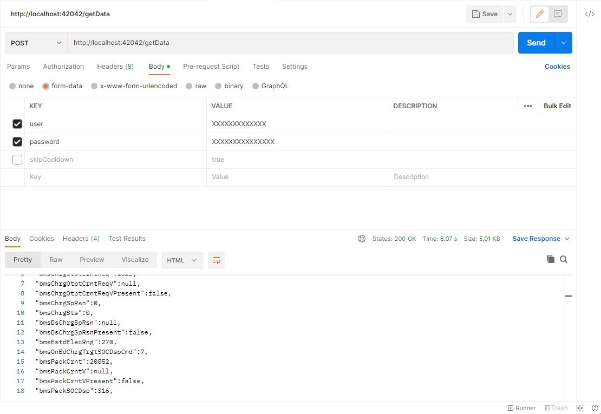

## SAIC Java Api Gateway
This sub-project implements a work in progress (WIP) HTTP Gateway for the SAIC Api. With a simple POST request to the API endpoint you can get the vehicleChargeStatus of your MG5 (2022) formatted as JSON.

This gateway sub-project is used by the Home Assistant Addon. 

You can run this locally in your network to integrate it with other third party services.

**Warning: Don't access/refresh the API regularly.** It will drain your 12v car battery and you will be unable to start it! I implemented a 600s API refresh cooldown cache. This will be improved in future versions.



## Run .jar
1. [Download latest release](https://github.com/ReverseEngineeringDE/SAIC-API-Documentation/raw/main/saic-java-api-gateway/ismart-api-1.0-SNAPSHOT-full.jar)
2. Execute .jar (e.g. on windows "java -jar .\ismart-api-1.0-SNAPSHOT-full.jar"
5. Access API gateway with "http://localhost:42042/getData"
4. Send a POST request with your SAIC API login data (email and password) to the /getData endpoint


## Installation / build by yourself
1. Change directory to /src
2. Type ```mvn clean install``` in your IDE or terminal
3. .jar file will be outputted to target folder
4. Execute .jar (e.g. on windows "java -jar .\ismart-api-1.0-SNAPSHOT-full.jar"
5. Access API gateway with "http://localhost:42042/getData"
6. Send a POST request with your SAIC API login data (email and password) to the /getData endpoint

## /getData endpoint
- endpoints: http://localhost:42042/getData

### POST parameters (required):

KEY: user

VALUE: yourIsmartAccountEmailHere

KEY: password

VALUE: yourIsmartAccountPasswordHere


### Optional (to skip the 600s cooldown)

KEY: skipCooldown

VALUE: true

## JSON Result example
If your login was successful the /getData endpoint will respond with following JSON:

```JSON
{
"applicationData":{
"bmsAdpPubChrgSttnDspCmd":0,
"bmsAltngChrgCrntDspCmd":0,
"bmsChrgCtrlDspCmd":2,
"bmsChrgOtptCrntReq":1023,
"bmsChrgOtptCrntReqV":null,
"bmsChrgOtptCrntReqVPresent":false,
"bmsChrgSpRsn":0,
"bmsChrgSts":0,
"bmsDsChrgSpRsn":null,
"bmsDsChrgSpRsnPresent":false,
"bmsEstdElecRng":284,
"bmsOnBdChrgTrgtSOCDspCmd":7,
"bmsPackCrnt":20000,
"bmsPackCrntV":null,
"bmsPackCrntVPresent":false,
"bmsPackSOCDsp":318,
"bmsPackVol":1575,
"bmsPTCHeatReqDspCmd":0,
"bmsPTCHeatResp":null,
"bmsPTCHeatRespPresent":false,
"bmsPTCHeatSpRsn":0,
"bmsPTCHeatSpRsnPresent":true,
"bmsReserCtrlDspCmd":0,
"bmsReserSpHourDspCmd":0,
"bmsReserSpMintueDspCmd":0,
"bmsReserStHourDspCmd":0,
"bmsReserStMintueDspCmd":0,
"ccuEleccLckCtrlDspCmd":null,
"ccuEleccLckCtrlDspCmdPresent":false,
"ccuOffBdChrgrPlugOn":null,
"ccuOffBdChrgrPlugOnPresent":false,
"ccuOnbdChrgrPlugOn":null,
"ccuOnbdChrgrPlugOnPresent":false,
"chargeStatus":{
"chargingDuration":0,
"chargingDurationPresent":true,
"chargingElectricityPhase":null,
"chargingElectricityPhasePresent":false,
"chargingGunState":false,
"chargingPileID":null,
"chargingPileIDPresent":false,
"chargingPileSupplier":null,
"chargingPileSupplierPresent":false,
"chargingType":1,
"endTime":1669447443,
"endTimePresent":true,
"extendedData1":null,
"extendedData1Present":false,
"extendedData2":null,
"extendedData2Present":false,
"extendedData3":null,
"extendedData3Present":false,
"extendedData4":null,
"extendedData4Present":false,
"fotaLowestVoltage":null,
"fotaLowestVoltagePresent":false,
"fuelRangeElec":800,
"lastChargeEndingPower":271,
"lastChargeEndingPowerPresent":true,
"mileage":XXXXXX,
"mileageOfDay":0,
"mileageOfDayPresent":true,
"mileageSinceLastCharge":90,
"mileageSinceLastChargePresent":true,
"powerUsageOfDay":7,
"powerUsageOfDayPresent":true,
"powerUsageSinceLastCharge":41,
"powerUsageSinceLastChargePresent":true,
"realtimePower":231,
"startTime":0,
"startTimePresent":true,
"staticEnergyConsumption":null,
"staticEnergyConsumptionPresent":false,
"totalBatteryCapacity":725,
"totalBatteryCapacityPresent":true,
"workingCurrent":20000,
"workingCurrentPresent":true,
"workingVoltage":1575,
"workingVoltagePresent":true
},
"chrgngAddedElecRng":null,
"chrgngAddedElecRngPresent":false,
"chrgngAddedElecRngV":null,
"chrgngAddedElecRngVPresent":false,
"chrgngDoorOpenCnd":null,
"chrgngDoorOpenCndPresent":false,
"chrgngDoorPosSts":null,
"chrgngDoorPosStsPresent":false,
"chrgngRmnngTime":1023,
"chrgngRmnngTimeV":1,
"chrgngSpdngTime":null,
"chrgngSpdngTimePresent":false,
"chrgngSpdngTimeV":null,
"chrgngSpdngTimeVPresent":false,
"clstrElecRngToEPT":80,
"disChrgngRmnngTime":null,
"disChrgngRmnngTimePresent":false,
"disChrgngRmnngTimeV":null,
"disChrgngRmnngTimeVPresent":false,
"imcuChrgngEstdElecRng":null,
"imcuChrgngEstdElecRngPresent":false,
"imcuChrgngEstdElecRngV":null,
"imcuChrgngEstdElecRngVPresent":false,
"imcuDschrgngEstdElecRng":null,
"imcuDschrgngEstdElecRngPresent":false,
"imcuDschrgngEstdElecRngV":null,
"imcuDschrgngEstdElecRngVPresent":false,
"imcuVehElecRng":null,
"imcuVehElecRngPresent":false,
"imcuVehElecRngV":null,
"imcuVehElecRngVPresent":false,
"onBdChrgrAltrCrntInptCrnt":null,
"onBdChrgrAltrCrntInptCrntPresent":false,
"onBdChrgrAltrCrntInptVol":null,
"onBdChrgrAltrCrntInptVolPresent":false
},
"body":{
"ackMessageCounter":null,
"ackMessageCounterPresent":false,
"ackRequired":null,
"ackRequiredPresent":false,
"applicationDataEncoding":"perUnaligned",
"applicationDataEncodingPresent":true,
"applicationDataLength":71,
"applicationDataLengthPresent":true,
"applicationDataProtocolVersion":768,
"applicationDataProtocolVersionPresent":true,
"applicationID":"516",
"dlMessageCounter":null,
"dlMessageCounterPresent":false,
"errorMessage":null,
"errorMessagePresent":false,
"eventCreationTime":1669552549,
"eventID":1418887435,
"eventIDPresent":true,
"messageID":6,
"result":0,
"resultPresent":true,
"testFlag":2,
"testFlagPresent":true,
"token":"XXXXXXXXXXXXXXXXXXXXXXXXXXXXXXXXXXXXXXXXXXXXXXX",
"tokenPresent":true,
"uid":"XXXXXXXXXXXXXXXXXXXXXXXXXXXXXXXXXXXXXXXXXXXXXXXXXXXXXXXX",
"uidPresent":true,
"ulMessageCounter":null,
"ulMessageCounterPresent":false,
"vin":"XXXXXXXXXXXXXXXXXX",
"vinPresent":true
},
"header":{
"dispatcherBodyEncoding":0,
"dispatcherMessageLength":117,
"protocolVersion":48
},
"reserved":"XXXXXXXXXXXXXXXXXXXXXXXXXXXX"
}
```

## Issues & Feedback
Feel free to open issues to give us some feedback!